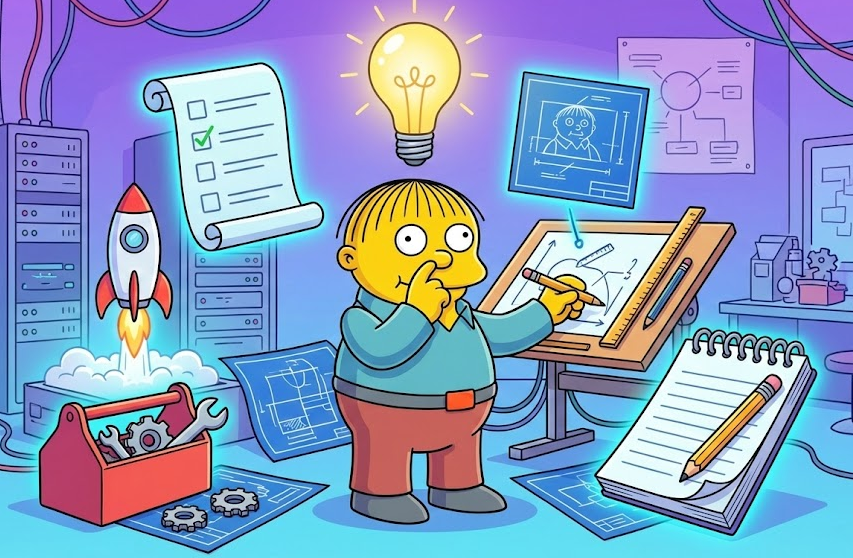

<div align="center">



# Smart Ralph

### *"Me fail specs? That's unpossible!"*

[](https://opensource.org/licenses/MIT)
[](https://claude.ai/code)
[](http://makeapullrequest.com)

**Spec-driven development for Claude Code. Dependency-aware task execution via [Beads](https://github.com/steveyegge/beads).**

Ralph Wiggum + Spec-Driven Development + Beads = <3

[Quick Start](#-quick-start) | [Commands](#-commands) | [How It Works](#-how-it-works) | [Beads Integration](#-beads-integration) | [Troubleshooting](#-troubleshooting)

</div>

---

## What is this?

Smart Ralph is a Claude Code plugin that turns your vague feature ideas into structured specs, then executes them task-by-task. Like having a tiny product team in your terminal.

```
You: "Add user authentication"
Ralph: *creates research.md, requirements.md, design.md, tasks.md*
Ralph: *executes each task with fresh context*
Ralph: "I'm helping!"
```

## Why "Ralph"?

Named after the [Ralph agentic loop pattern](https://ghuntley.com/ralph/) and everyone's favorite Springfield student. Ralph doesn't overthink. Ralph just does the next task. Be like Ralph.

---

## Requirements

**v3.0.0** requires two dependencies:

### 1. Beads (Required)

[Beads](https://github.com/steveyegge/beads) is a git-based issue tracker designed for AI agents. Smart Ralph uses it for dependency-aware task execution.

```bash
# macOS
brew install steveyegge/tap/beads

# Verify installation
bd --version
```

### 2. Ralph Wiggum Plugin (Required)

```bash
/plugin install ralph-loop@claude-plugins-official
```

Ralph Wiggum provides the execution loop. Smart Ralph provides the spec-driven workflow. Beads provides dependency tracking.

---

## Installation

### From Marketplace

```bash
# 1. Install Beads CLI
brew install steveyegge/tap/beads

# 2. Install Ralph Wiggum plugin
/plugin install ralph-loop@claude-plugins-official

# 3. Add the marketplace
/plugin marketplace add tzachbon/smart-ralph

# 4. Install the plugin
/plugin install ralph-specum@smart-ralph

# 5. Restart Claude Code
```

### From GitHub

```bash
# 1. Install Beads CLI
brew install steveyegge/tap/beads

# 2. Install Ralph Wiggum plugin
/plugin install ralph-loop@claude-plugins-official

# 3. Install Smart Ralph
/plugin install https://github.com/tzachbon/smart-ralph
```

### Local Development

```bash
# 1. Install Beads CLI
brew install steveyegge/tap/beads

# 2. Install Ralph Wiggum plugin
/plugin install ralph-loop@claude-plugins-official

# 3. Clone and run
git clone https://github.com/tzachbon/smart-ralph.git
cd smart-ralph/plugins/ralph-specum
claude --plugin-dir $(pwd)
```

---

## Quick Start

```bash
# The smart way (auto-detects resume or new)
/ralph-specum:start user-auth Add JWT authentication

# Quick mode (skip spec phases, auto-generate everything)
/ralph-specum:start "Add user auth" --quick

# The step-by-step way
/ralph-specum:new user-auth Add JWT authentication
/ralph-specum:requirements
/ralph-specum:design
/ralph-specum:tasks
/ralph-specum:implement
```

---

## Commands

| Command | What it does |
|---------|--------------|
| `/ralph-specum:start [name] [goal]` | Smart entry: resume existing or create new |
| `/ralph-specum:start [goal] --quick` | Quick mode: auto-generate all specs and execute |
| `/ralph-specum:new <name> [goal]` | Create new spec, start research |
| `/ralph-specum:research` | Run/re-run research phase |
| `/ralph-specum:requirements` | Generate requirements from research |
| `/ralph-specum:design` | Generate technical design |
| `/ralph-specum:tasks` | Break design into executable tasks |
| `/ralph-specum:implement` | Execute tasks one-by-one |
| `/ralph-specum:status` | Show all specs and progress |
| `/ralph-specum:switch <name>` | Change active spec |
| `/ralph-specum:cancel` | Cancel loop, cleanup state |
| `/ralph-specum:help` | Show help |

---

## How It Works

```
        "I want a feature!"
               |
               v
    +---------------------+
    |      Research       |  <- Analyzes codebase, searches web
    +---------------------+
               |
               v
    +---------------------+
    |    Requirements     |  <- User stories, acceptance criteria
    +---------------------+
               |
               v
    +---------------------+
    |       Design        |  <- Architecture, patterns, decisions
    +---------------------+
               |
               v
    +---------------------+
    |       Tasks         |  <- POC-first task breakdown
    +---------------------+
               |
               v
    +---------------------+
    |     Execution       |  <- Task-by-task with fresh context
    +---------------------+
               |
               v
          "I did it!"
```

### The Agents

Each phase uses a specialized sub-agent:

| Phase | Agent | Superpower |
|-------|-------|------------|
| Research | `research-analyst` | Web search, codebase analysis, feasibility checks |
| Requirements | `product-manager` | User stories, acceptance criteria, business value |
| Design | `architect-reviewer` | Architecture patterns, technical trade-offs |
| Tasks | `task-planner` | POC-first breakdown, task sequencing |
| Execution | `spec-executor` | Autonomous implementation, quality gates |

### Task Execution Workflow

Tasks follow a 4-phase structure:

1. **Make It Work** - POC validation, skip tests initially
2. **Refactoring** - Clean up the code
3. **Testing** - Unit, integration, e2e tests
4. **Quality Gates** - Lint, types, CI checks

---

## Beads Integration

Smart Ralph v3.0 uses [Beads](https://github.com/steveyegge/beads) for dependency-aware task management. This is a fundamental change from v2.x's linear task execution.

### What Beads Provides

| Feature | Benefit |
|---------|---------|
| **Dependency DAG** | Tasks define what they `block`, enabling true parallel execution |
| **`bd list --ready`** | Find all unblocked tasks in ~10ms |
| **Hash-based IDs** | No collisions during parallel task creation |
| **Git-native sync** | State exports to JSONL, syncs via git |
| **`bd doctor`** | Detects orphaned work (committed but not closed) |

### How It Works

```
┌─────────────────┐
│  1.1 Setup      │
│  OAuth2 config  │
└────────┬────────┘
         │ blocks
┌────────▼────────┐
│ 1.2 Create auth │
│    endpoints    │
└────────┬────────┘
         │ blocks
    ┌────┴────┐
    │         │
┌───▼───┐ ┌───▼───┐
│ 1.3   │ │ 1.4   │  ← Both unblocked when 1.2 completes
│ Login │ │Logout │  ← Execute in parallel automatically
└───┬───┘ └───┬───┘
    │         │
    └────┬────┘
         │ blocks
┌────────▼────────┐
│ V1 [VERIFY]     │
│ Quality check   │
└─────────────────┘
```

### Beads Commands Used

| Command | When Used |
|---------|-----------|
| `bd create --parent $SPEC` | Task-planner creates child issues for each task |
| `bd create --blocks $ID` | Task-planner sets up dependency relationships |
| `bd list --ready --json` | Coordinator finds executable tasks |
| `bd close $ID` | Spec-executor marks tasks complete |
| `bd sync` | Completion protocol exports state to git |
| `bd doctor` | Completion protocol verifies no orphaned work |

### Commit Messages

All commits include Beads issue IDs for audit trail:

```bash
feat(auth): implement OAuth2 login (bd-abc123)
refactor(auth): extract token validation (bd-def456)
test(auth): add OAuth2 integration tests (bd-ghi789)
```

### Land the Plane Protocol

Every execution ends with:

```bash
bd doctor          # Check for orphaned work
git pull --rebase  # Sync with remote
bd sync            # Export issues to JSONL
git push           # Push everything
```

---

## Project Structure

```
smart-ralph/
├── .claude-plugin/
│   └── marketplace.json
├── plugins/
│   └── ralph-specum/
│       ├── .claude-plugin/
│       │   └── plugin.json
│       ├── agents/           # Sub-agent definitions
│       ├── commands/         # Slash commands
│       ├── hooks/            # Stop watcher (logging only)
│       ├── templates/        # Spec templates
│       └── schemas/          # Validation schemas
└── README.md
```

### Your Specs

Specs live in `./specs/` in your project:

```
./specs/
├── .current-spec           # Active spec name
└── my-feature/
    ├── .ralph-state.json   # Loop state (deleted on completion)
    ├── .progress.md        # Progress tracking
    ├── research.md
    ├── requirements.md
    ├── design.md
    └── tasks.md
```

---

## Troubleshooting

**"Beads not installed" or "bd: command not found"?**
Install Beads: `brew install steveyegge/tap/beads`

**"Beads issue ID missing"?**
Run `/ralph-specum:research` again to create the parent Beads issue, or manually: `bd create --title "my-spec" --type epic`

**"Ralph Wiggum plugin not found"?**
Install the dependency: `/plugin install ralph-loop@claude-plugins-official`

**"stop-handler.sh: No such file or directory"?**
Old v1.x installation conflict. Reinstall the plugin or see [TROUBLESHOOTING.md](TROUBLESHOOTING.md).

**Task keeps failing?**
After max iterations, the loop stops. Check `.progress.md` for errors. Fix manually, then `/ralph-specum:implement` to resume.

**Want to start over?**
`/ralph-specum:cancel` cleans up state (both Ralph Wiggum and Smart Ralph state files). Then start fresh.

**Resume existing spec?**
Just `/ralph-specum:start` - it auto-detects and continues where you left off.

**"Loop state conflict"?**
Another Ralph loop may be running. Use `/cancel-ralph` to reset Ralph Wiggum state, then retry.

**More issues?** See the full [Troubleshooting Guide](TROUBLESHOOTING.md).

---

## Breaking Changes

### v3.0.0

**Beads dependency required**

Starting with v3.0.0, Smart Ralph requires [Beads](https://github.com/steveyegge/beads) for dependency-aware task execution.

**Migration from v2.x:**

1. Install Beads: `brew install steveyegge/tap/beads`
2. Run `bd init` in your project (if not already initialized)
3. Restart Claude Code
4. Existing specs will need to be re-generated to include Beads issue mappings

**What changed:**
- Beads is now a hard requirement (no fallback mode)
- Task-planner creates Beads issues with `--blocks` dependencies
- Spec-executor closes Beads issues and includes IDs in commits
- Coordinator uses `bd list --ready` instead of linear `taskIndex`
- Completion protocol includes `bd sync` and `bd doctor`
- State schema includes `beadsSpecId`, `beadsEnabled`, `taskBeadsMap`

**Why:**
- True dependency DAG replaces linear task list with `[P]` markers
- Automatic parallel execution discovery
- Git-native state sync via JSONL export
- Audit trail with Beads IDs in commit messages
- `bd doctor` detects orphaned work automatically

### v2.0.0

**Ralph Wiggum dependency required**

Starting with v2.0.0, Smart Ralph delegates task execution to the official Ralph Wiggum plugin.

**Migration from v1.x:** See [MIGRATION.md](MIGRATION.md) for detailed guide.

Quick version:
1. Install Ralph Wiggum: `/plugin install ralph-loop@claude-plugins-official`
2. Restart Claude Code
3. Existing specs continue working. No spec file changes needed.

**What changed:**
- Custom stop-handler removed. Ralph Wiggum provides the execution loop.
- `/implement` now invokes `/ralph-loop` internally
- `/cancel` now calls `/cancel-ralph` for cleanup
- Same task format, same verification, same workflow. Just different internals.

**Why:**
- Less code to maintain (deleted ~300 lines of bash)
- Official plugin gets updates and fixes
- Better reliability for the execution loop

---

## Contributing

PRs welcome! This project is friendly to first-time contributors.

1. Fork it
2. Create your feature branch (`git checkout -b feature/amazing`)
3. Commit your changes
4. Push to the branch
5. Open a PR

---

## Credits

- [Ralph agentic loop pattern](https://ghuntley.com/ralph/) by Geoffrey Huntley
- [Beads](https://github.com/steveyegge/beads) by Steve Yegge - git-based issue tracker for AI agents
- Built for [Claude Code](https://claude.ai/code)
- Inspired by every developer who wished their AI could just figure out the whole feature

---

<div align="center">

**Made with confusion and determination**

*"The doctor said I wouldn't have so many nosebleeds if I kept my finger outta there."*

MIT License

</div>
