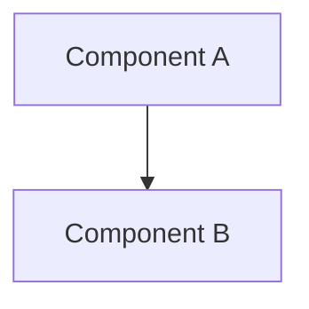

# Spec-Driven Development Workflow

This skill guides you through spec-driven development with smart compaction between phases and tasks.

## Core Principle

**Always read `.ralph-progress.md` first** after any restart or compaction. This file is your memory across compactions.

## Phase Workflow

### 1. Requirements Phase

**Goal**: Capture what needs to be built.

**Read first**:
- `.ralph-progress.md` (always)
- User's goal description

**Generate**: `requirements.md`

```markdown
# Requirements: <Feature Name>

## User Story
As a <role>, I want <feature>, so that <benefit>.

## Acceptance Criteria
- [ ] AC-1: <criterion>
- [ ] AC-2: <criterion>

## Functional Requirements
| ID | Requirement | Priority |
|----|-------------|----------|
| FR-1 | <description> | High |
| FR-2 | <description> | Medium |

## Non-Functional Requirements
| ID | Requirement | Metric |
|----|-------------|--------|
| NFR-1 | Performance | <target> |
| NFR-2 | Security | <standard> |

## Glossary
- **Term**: Definition

## Out of Scope
- <item>

## Success Criteria
- <measurable outcome>
```

**Update `.ralph-progress.md`**:
- Set phase to "requirements"
- Add any discovered constraints as learnings

**Output**: `PHASE_COMPLETE: requirements`

### 2. Design Phase

**Goal**: Define how to build it.

**Read first**:
- `.ralph-progress.md`
- `requirements.md`

**Generate**: `design.md`

```markdown
# Design: <Feature Name>

## Architecture Overview

<High-level description>

## Component Diagram



## File Structure

| File | Action | Purpose |
|------|--------|---------|
| src/auth/login.ts | Create | Login handler |
| src/auth/types.ts | Create | Type definitions |

## Key Patterns

- Pattern 1: <description>
- Pattern 2: <description>

## Technical Constraints

- <constraint>

## Dependencies

- <package>: <version>

## Considerations

- <edge case or gotcha>
```

**Update `.ralph-progress.md`**:
- Set phase to "design"
- Add architectural decisions as learnings

**Output**: `PHASE_COMPLETE: design`

### 3. Tasks Phase

**Goal**: Break down into executable tasks.

**Read first**:
- `.ralph-progress.md`
- `requirements.md`
- `design.md`

**Generate**: `tasks.md`

```markdown
# Tasks: <Feature Name>

## Phase 1: Scaffolding
- [ ] Task 1.1: Create directory structure
- [ ] Task 1.2: Add base types

## Phase 2: Core Implementation
- [ ] Task 2.1: Implement main logic
- [ ] Task 2.2: Add error handling

## Phase 3: Integration
- [ ] Task 3.1: Wire up components
- [ ] Task 3.2: Add configuration

## Phase 4: Testing
- [ ] Task 4.1: Unit tests
- [ ] Task 4.2: Integration tests

## Phase 5: Quality Gates
- [ ] Task 5.1: Lint check
- [ ] Task 5.2: Type check
- [ ] Task 5.3: All tests pass
```

**Update `.ralph-state.json`**:
- Set `totalTasks` to count of all tasks
- Set `taskIndex` to 0

**Update `.ralph-progress.md`**:
- Set phase to "tasks"
- Copy task list to Completed section (all unchecked)

**Output**: `PHASE_COMPLETE: tasks`

### 4. Execution Phase

**Goal**: Execute tasks one by one.

**Read first**:
- `.ralph-progress.md` (CRITICAL)
- `tasks.md`
- Relevant spec files as needed

**For each task**:
1. Read current task from `.ralph-progress.md`
2. Execute the task
3. Update `.ralph-progress.md`:
   - Mark task as `[x]` in Completed section
   - Add any learnings discovered
   - Update "Current Goal" to next task
4. Update `.ralph-state.json`:
   - Increment `taskIndex`
   - Update `currentTaskName`

**Output per task**: `TASK_COMPLETE: <task_number>`

**When all tasks done**:
1. Run quality gates
2. Verify all acceptance criteria
3. Output: `RALPH_COMPLETE`

## Progress File Management

### Structure

```markdown
# Ralph Progress

## Current Goal
**Phase**: <current phase>
**Task**: <N/total> - <task name>
**Objective**: <what to accomplish>

## Completed
- [x] Task 1: <name>
- [x] Task 2: <name>
- [ ] Task 3: <name> (IN PROGRESS)
- [ ] Task 4: <name>

## Learnings
- <insight 1>
- <insight 2>

## Blockers
- <blocker if any>

## Next Steps
1. <immediate next action>
2. <following action>
```

### Update Rules

1. **Before any compaction**: Update all sections
2. **On task complete**: Mark task done, add learnings
3. **On learning discovered**: Append immediately
4. **On blocker found**: Add to Blockers section
5. **On RALPH_COMPLETE**: Delete file

## Compaction Instructions

Use these exact compact commands at phase transitions:

### After Requirements
```
/compact preserve: user stories, acceptance criteria (AC-*), functional requirements (FR-*), non-functional requirements (NFR-*), glossary terms. Read .ralph-progress.md for full context.
```

### After Design
```
/compact preserve: architecture decisions, component boundaries, file paths to modify, patterns to follow. Read .ralph-progress.md for full context.
```

### After Tasks
```
/compact preserve: task list with IDs, dependencies between tasks, quality gate requirements. Read .ralph-progress.md for full context.
```

### After Each Task
```
/compact preserve: current task context only, verification results. Read .ralph-progress.md for completed tasks and learnings.
```

## Quality Standards

### Requirements Quality
- Every requirement has acceptance criteria
- No ambiguous language ("fast", "easy", "simple")
- Clear out-of-scope section

### Design Quality
- Architecture matches requirements
- File structure is complete
- Patterns are justified

### Task Quality
- Tasks are atomic (one clear outcome)
- Tasks are ordered by dependency
- Quality gates are last

### Execution Quality
- Each task verified before marking done
- Learnings captured immediately
- Progress file always current

## Anti-Patterns

- **Never skip reading `.ralph-progress.md`** after compaction
- **Never update state without updating progress file**
- **Never mark task complete without verification**
- **Never compact without updating progress file first**
- **Never assume context is preserved** after compaction
