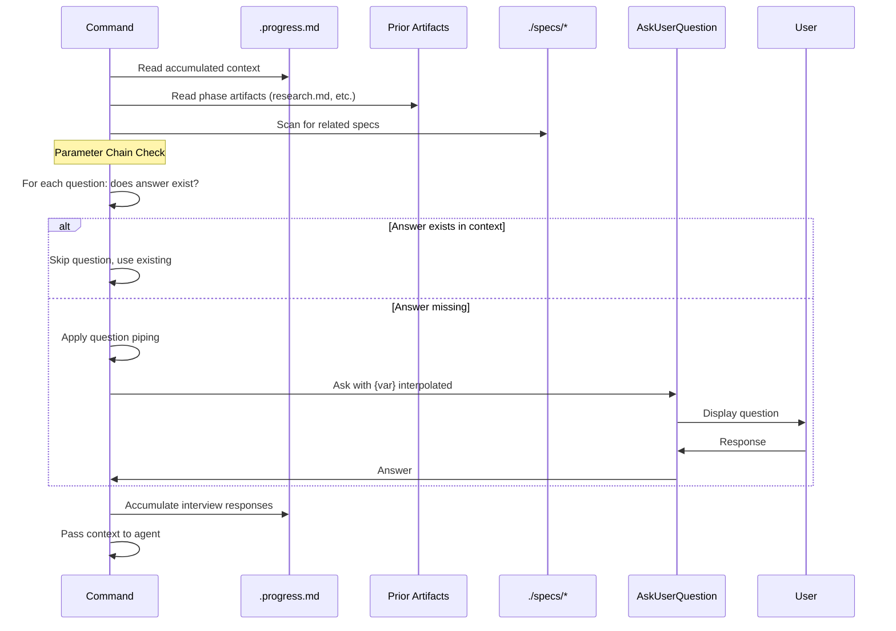

# Technical Design: Adaptive Interview System

## Design Inputs

From goal interview:
- Problem type: Fixing a bug - questions are too static
- Constraints: No special constraints
- Success: Questions adapt based on context

From requirements interview:
- Primary users: Both developers and end users
- Priority: Code quality and maintainability

Architecture style: Extend existing architecture (modify the 5 existing interview sections in command files)

## Architecture Overview

Transform static interview questions into context-aware, adaptive questions using three mechanisms:
1. **Parameter Chain** - Check if info exists in prior artifacts before asking
2. **Question Piping** - Inject prior answers into question text using `{variable}` syntax
3. **Spec Awareness** - Scan `./specs/` for related specs and surface summaries

All logic resides in command files (coordinators). No changes to agents. Context accumulates in `.progress.md`.

## Architecture Diagram

```mermaid
graph TB
    subgraph Commands["Command Layer (Interview Logic)"]
        START[start.md] --> |writes| PROG
        RES[research.md] --> |reads| PROG
        RES --> |writes| PROG
        REQ[requirements.md] --> |reads| PROG
        REQ --> |reads| RESMD[research.md]
        REQ --> |writes| PROG
        DES[design.md] --> |reads| PROG
        DES --> |reads| REQMD[requirements.md]
        DES --> |writes| PROG
        TASK[tasks.md] --> |reads| PROG
        TASK --> |reads| DESMD[design.md]
        TASK --> |writes| PROG
    end

    subgraph Context["Context Sources"]
        PROG[.progress.md]
        SPECS[./specs/*]
        RESMD
        REQMD
        DESMD
    end

    subgraph Interview["Adaptive Interview"]
        CHAIN[Parameter Chain Check]
        PIPE[Question Piping]
        SCAN[Spec Scanner]
    end

    RES --> CHAIN
    REQ --> CHAIN
    DES --> CHAIN
    TASK --> CHAIN

    CHAIN --> |skip if exists| PIPE
    PIPE --> |inject {vars}| AUQ[AskUserQuestion]
    SCAN --> |top 3 related| PROG
```

## Data Flow



## Technical Decisions

| Decision | Options Considered | Choice | Rationale |
|----------|-------------------|--------|-----------|
| Context storage | Separate file per phase vs Single .progress.md | Single .progress.md | Simpler accumulation, single source of truth |
| Piping syntax | Handlebars {{var}} vs Simple {var} | Simple {var} | Matches existing patterns, less escaping |
| Spec scanning | Full content vs Summary only | Summary (first 100 chars of goal) | NFR-3: <2s for 50 specs |
| Related spec matching | AI-based vs Keyword match | Keyword match (spec name overlap) | Testable, predictable, no AI calls |
| Question skip logic | Soft skip (show disabled) vs Hard skip | Hard skip | Cleaner UX, less noise |
| Max related specs | All vs Top N | Top 3 | Prevent overwhelm per requirements |
| Context extraction | Regex vs Section headers | Section headers | Markdown has consistent structure |

## Component Design

### 1. Context Accumulator

**Location**: Each command file, "Accumulate Interview Context" section

**Purpose**: Store all interview responses in `.progress.md` under `## Interview Responses`

```markdown
## Interview Responses

### Goal Interview
- Problem: Fixing a bug or issue
- Constraints: Must integrate with existing code
- Success: Tests pass and code works

### Research Interview
- Technical approach: Follow existing patterns
- Known constraints: Performance critical

### Requirements Interview
- Primary users: Both developers and end users
- Priority: Code quality and maintainability
... (continues for each phase)
```

### 2. Parameter Chain Checker

**Location**: Each command file, before AskUserQuestion call

**Purpose**: Check if answer already exists; skip question if found

**Logic**:
```
For each question:
  1. Extract question key (e.g., "constraints", "technical_approach")
  2. Search .progress.md "Interview Responses" section for key
  3. Search prior phase artifact for related content
  4. If found -> skip question, log "Skipped: {question} - already answered"
  5. If not found -> include in AskUserQuestion call
```

**Mapping**: Question-to-key mapping defined per interview section:

| Phase | Question | Key to Check | Check Location |
|-------|----------|--------------|----------------|
| Research | "Any known constraints?" | constraints | .progress.md Goal Interview |
| Requirements | "Primary users?" | primary_users | research.md, .progress.md |
| Design | "Technology constraints?" | constraints, tech_constraints | requirements.md, .progress.md |
| Tasks | "Testing depth?" | testing, test_strategy | design.md |

### 3. Question Piper

**Location**: Each command file, question text

**Purpose**: Interpolate prior answers into question text

**Syntax**: `{variable_name}` replaced with value from context

**Available Variables** (accumulated across phases):

| Variable | Source | Example Value |
|----------|--------|---------------|
| `{goal}` | Original goal from start | "Add user authentication" |
| `{problem_type}` | Goal interview Q1 | "Adding new functionality" |
| `{constraints}` | Goal interview Q2 | "Must integrate with existing code" |
| `{success_criteria}` | Goal interview Q3 | "Users can complete workflow" |
| `{tech_approach}` | Research interview Q1 | "Follow existing patterns" |
| `{primary_users}` | Requirements interview Q1 | "End users via UI" |
| `{priority}` | Requirements interview Q2 | "Code quality" |
| `{architecture}` | Design interview Q1 | "Extend existing architecture" |

**Fallback**: If variable not found, show original question without interpolation.

**Example transformation**:
```
Before: "Given your goal of {goal}, what architecture style fits?"
After:  "Given your goal of Add user authentication, what architecture style fits?"
```

### 4. Spec Scanner

**Location**: `start.md` and `research.md` (early phases only)

**Purpose**: Find related specs and surface summaries

**Algorithm**:
```
1. List ./specs/* directories (excluding current spec, .current-spec file)
2. For each spec directory:
   a. Read .progress.md if exists
   b. Extract "Original Goal" section (first 100 chars)
   c. Calculate relevance score:
      - +2 if spec name shares word with current spec name
      - +1 if goal text shares 3+ words with current goal
3. Sort by relevance score descending
4. Return top 3 specs with summaries
```

**Output Format** (displayed before questions):
```
Related specs found:
- goal-interview: "Implement exhaustive user interviews during the research phase..."
- qa-verification: "Add verification tasks to ensure quality gates..."
```

### 5. Adaptive Follow-up Enhancer

**Location**: Each command file, "Adaptive Depth" section

**Purpose**: Make "Other" follow-ups context-specific

**Current Pattern** (generic):
```
"You mentioned [Other response]. Can you elaborate?"
```

**New Pattern** (contextual):
```
"You mentioned {other_response}. How does this relate to your {problem_type} goal of {goal}?"
```

**Option-specific branches** (P2):

| Original Option | Follow-up Focus |
|-----------------|-----------------|
| "Performance is critical" | Ask: "What latency/throughput targets?" |
| "Must integrate with existing code" | Ask: "Which components specifically?" |
| "Create isolated module" | Ask: "What boundaries and interfaces?" |

## File Modifications

| File | Lines | Action | Changes |
|------|-------|--------|---------|
| commands/start.md | 528-600 | Modify | Add spec scanner call, update questions with piping vars, add response accumulator |
| commands/research.md | 80-131 | Modify | Add parameter chain check, add piping vars, add response accumulator, read .progress.md |
| commands/requirements.md | 37-88 | Modify | Add parameter chain check, read research.md, add piping vars, add response accumulator |
| commands/design.md | 39-90 | Modify | Add parameter chain check, read requirements.md, add piping vars, add response accumulator |
| commands/tasks.md | 40-91 | Modify | Add parameter chain check, read design.md, add piping vars, add response accumulator |

## Interfaces / Data Structures

### InterviewContext (accumulated in .progress.md)

```typescript
interface InterviewContext {
  // Goal phase
  goal: string;
  problem_type: "bug" | "new_feature" | "improvement" | "other";
  constraints: string;
  success_criteria: string;

  // Research phase
  tech_approach: "existing_patterns" | "new_patterns" | "hybrid" | "other";
  known_constraints: string;

  // Requirements phase
  primary_users: "developers" | "end_users" | "both" | "other";
  priority: "speed" | "quality" | "completeness" | "other";

  // Design phase
  architecture: "extend" | "isolated" | "refactor" | "other";
  tech_constraints: string;

  // Tasks phase
  testing_depth: "standard" | "minimal" | "comprehensive" | "other";
  deployment: "standard_ci" | "feature_flag" | "gradual" | "other";
}
```

### RelatedSpec (from spec scanner)

```typescript
interface RelatedSpec {
  name: string;           // Spec directory name
  summary: string;        // First 100 chars of goal
  relevance_score: number; // 0-5 based on matching algorithm
}
```

### ParameterChainResult

```typescript
interface ParameterChainResult {
  question_key: string;
  found: boolean;
  source: "progress_md" | "research_md" | "requirements_md" | "design_md";
  value?: string;
}
```

## Error Handling

| Error Scenario | Handling Strategy | User Impact |
|----------------|-------------------|-------------|
| .progress.md missing | Create fresh, proceed with all questions | None - normal for new specs |
| Prior artifact missing | Skip parameter check for that source | Questions asked normally |
| Variable not found for piping | Use original question text (no interpolation) | Slightly less personalized question |
| Spec scan finds 0 related | Skip "Related specs" section | None |
| Spec .progress.md unreadable | Skip that spec in scan | One less related spec shown |
| AskUserQuestion timeout | Retry once, then use default answer | Brief delay, uses fallback |

## Edge Cases

- **Empty .progress.md**: Treat as new spec, ask all questions
- **Circular reference in specs**: Spec scanner excludes current spec by name
- **Very long goal text**: Truncate to 100 chars for summary display
- **Special chars in piped variables**: Escape markdown special chars
- **Multiple specs with same name word**: All included, sorted by score
- **User skips interview (--quick)**: No accumulation, agents get defaults
- **Phase run out of order**: Parameter chain works regardless of order, checks all available sources

## Test Strategy

### Manual Test Scenarios

| FR | Test Scenario | Steps | Expected Result |
|----|---------------|-------|-----------------|
| FR-1 | Parameter chain skip | 1. Complete goal interview with constraints. 2. Run research. | Research Q2 about constraints is skipped |
| FR-2 | Question piping | 1. Set goal "Add auth". 2. Run design. | Design Q1 contains "Add auth" in text |
| FR-3 | Spec awareness | 1. Have 3+ specs in ./specs/. 2. Run start. | Related specs shown before questions |
| FR-4 | Phase context | 1. Complete research (mentions "React"). 2. Run requirements. | Requirements questions reference React |
| FR-5 | Adaptive follow-up | 1. Select "Other" in any interview. | Follow-up mentions prior context |
| FR-6 | Accumulate responses | 1. Complete all phases. 2. Check .progress.md | All responses in Interview Responses section |
| FR-7 | Option branching | 1. Select "Performance critical". | Follow-up asks about metrics |
| FR-8 | Related spec summary | 1. Have specs. 2. Run start. | 1-2 sentence summaries shown |
| FR-9 | Max 5 options | 1. Check all questions. | No question has >5 options |
| FR-10 | Explain why | 1. Check question text. | Each includes brief rationale |

### Regression Tests

| Scenario | Steps | Expected |
|----------|-------|----------|
| Quick mode bypass | Run `/start test --quick` | No interview questions appear |
| Existing behavior | Run without changes | Questions appear as before |

## Implementation Order

1. **Add response accumulator to start.md** - Foundation for other phases
2. **Implement question piping syntax** - Define {var} handling in each command
3. **Add parameter chain check to research.md** - First phase that can skip
4. **Add spec scanner to start.md** - Surface related specs early
5. **Propagate parameter chain to requirements, design, tasks** - Remaining phases
6. **Enhance adaptive follow-ups** - Option-specific branches (P2)
7. **Manual testing per FR** - Verify each requirement

## Performance Considerations

- Spec scan reads only .progress.md per spec (not full artifacts)
- Parameter chain checks use exact key matching (no fuzzy search)
- Question piping is simple string replacement (no regex)
- Target: <2s for spec scan with 50 specs (NFR-3)

## Security Considerations

- No external API calls (all local file reads)
- No user input executed as code
- Piped variables escaped for markdown injection
