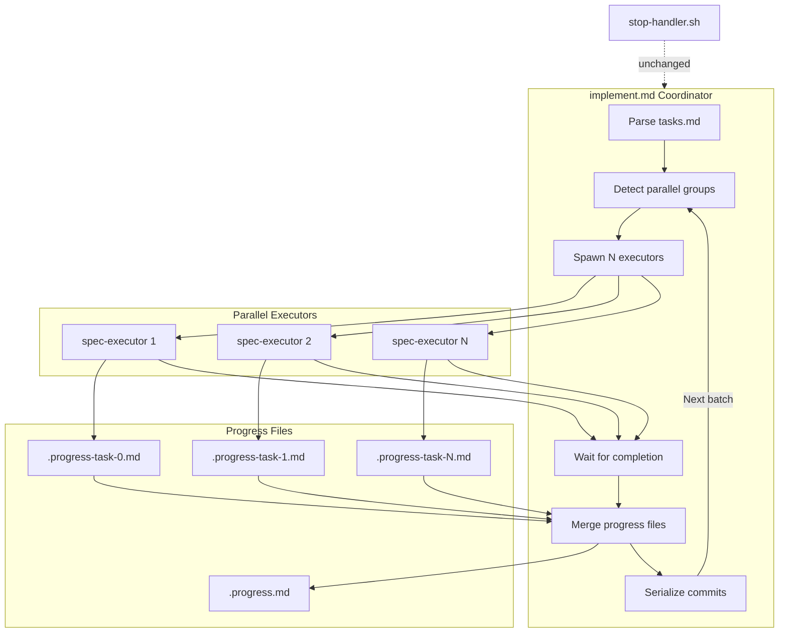
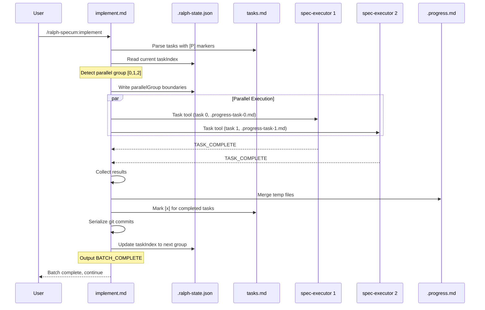

# Design: Parallel Task Execution

## Overview

Extend implement.md coordinator to detect `[P]` markers in tasks.md, group consecutive parallel tasks into batches, spawn multiple spec-executors via Task tool in a single message, wait for completion, merge isolated progress files, and continue execution. Stop-handler remains unchanged. All parallel logic lives in the coordinator.

## Architecture



## Data Flow



## Components

### Component 1: Task Parser Extension

**Purpose**: Parse tasks.md and identify [P] markers on task lines

**Responsibilities**:
- Read tasks.md line by line
- Detect `[P]` marker in task description using regex
- Detect `[VERIFY]` and `[SEQUENTIAL]` override markers
- Build list of tasks with parallel eligibility flag

**Interface**:
```typescript
interface ParsedTask {
  index: number;           // 0-based task index
  description: string;     // Task title/description line
  isParallel: boolean;     // Has [P] marker
  isVerify: boolean;       // Has [VERIFY] marker (never parallel)
  isSequential: boolean;   // Has [SEQUENTIAL] marker (never parallel)
}

// Parsing logic (in implement.md markdown instructions)
// Regex: /\[P\]/ for parallel marker
// Regex: /\[VERIFY\]/ for verify override
// Regex: /\[SEQUENTIAL\]/ for sequential override
```

### Component 2: Parallel Group Detector

**Purpose**: Group consecutive parallelizable tasks into batches

**Responsibilities**:
- Iterate through parsed tasks starting from current taskIndex
- Collect consecutive tasks where `isParallel=true` and `isVerify=false` and `isSequential=false`
- Stop group at first non-parallel task or end of tasks
- Return group boundaries (start index, end index)

**Interface**:
```typescript
interface ParallelGroup {
  startIndex: number;      // First task in group (inclusive)
  endIndex: number;        // Last task in group (inclusive)
  taskIndices: number[];   // All task indices in group
  isParallel: boolean;     // True if group has 2+ tasks
}

// Algorithm:
// 1. Start at current taskIndex
// 2. If current task is [P] (and not [VERIFY]/[SEQUENTIAL]):
//    - Add to group, advance to next task
//    - Repeat until non-[P] or [VERIFY] or end
// 3. If current task is NOT [P]:
//    - Group is single task at taskIndex
// 4. Return group boundaries
```

### Component 3: Parallel Executor Spawner

**Purpose**: Invoke multiple spec-executors via Task tool in one message

**Responsibilities**:
- For each task in parallel group, prepare Task tool invocation
- Pass isolated progress file path (.progress-task-N.md) to each executor
- Include task-specific context in prompt
- All Task tool calls in single coordinator message

**Interface**:
```typescript
interface ExecutorInvocation {
  taskIndex: number;
  progressFile: string;    // .progress-task-{taskIndex}.md
  taskContent: string;     // Full task block from tasks.md
  specPath: string;
  specName: string;
}

// Prompt template for parallel executor:
// "You are executing task for spec: $spec
//  Task index: $taskIndex
//  Progress file: $progressFile (write learnings here, NOT .progress.md)
//  ..."
```

### Component 4: Progress File Merger

**Purpose**: Combine isolated progress files into main .progress.md after batch

**Responsibilities**:
- Read all .progress-task-N.md files for completed tasks
- Extract Learnings sections from each
- Extract Completed Tasks entries from each
- Append to .progress.md in task order
- Delete temp files after successful merge

**Interface**:
```typescript
interface ProgressMerge {
  tempFiles: string[];           // Paths to temp progress files
  mainProgressFile: string;      // .progress.md path
  learnings: string[];           // Extracted learnings to append
  completedTasks: string[];      // Completed task entries to append
}

// Merge strategy:
// 1. For each temp file in task order:
//    - Read file content
//    - Extract "## Learnings" section additions
//    - Extract "## Completed Tasks" new entries
// 2. Append learnings to .progress.md Learnings section
// 3. Append completed tasks to .progress.md Completed Tasks section
// 4. Delete temp files
```

### Component 5: State Schema Extension

**Purpose**: Track parallel execution state in .ralph-state.json

**Responsibilities**:
- Track current parallel group boundaries
- Track per-task completion status within batch
- Track which tasks failed for retry

**Interface**:
```typescript
// Extended state schema
interface RalphState {
  // Existing fields
  source: "spec" | "plan" | "direct";
  name: string;
  basePath: string;
  phase: "research" | "requirements" | "design" | "tasks" | "execution";
  taskIndex: number;
  totalTasks: number;
  taskIteration: number;
  maxTaskIterations: number;
  globalIteration: number;
  maxGlobalIterations: number;

  // NEW: Parallel execution fields
  parallelGroup?: {
    startIndex: number;      // First task in current parallel group
    endIndex: number;        // Last task in current parallel group
    taskIndices: number[];   // All task indices in group
  };
  taskResults?: {
    [taskIndex: number]: {
      status: "pending" | "success" | "failed";
      error?: string;
    };
  };
}
```

## Technical Decisions

| Decision | Options Considered | Choice | Rationale |
|----------|-------------------|--------|-----------|
| Parallel marker syntax | `[PARALLEL]...[/PARALLEL]` blocks, `[P]` inline marker, dependency graph | `[P]` inline marker | Simplest syntax, consecutive grouping avoids complex parsing, backwards compatible |
| Group detection | Explicit blocks, consecutive inference, dependency DAG | Consecutive inference | Simple algorithm, no block delimiters needed, [VERIFY] naturally breaks groups |
| Progress isolation | Mutex/lock on .progress.md, temp files per executor, database | Temp files (.progress-task-N.md) | No locking needed, merge is deterministic, survives crashes |
| Commit strategy | Parallel commits, single batch commit, serial commits | Serial commits after batch | Avoid git conflicts, clear history, straightforward |
| Completion signal | TASK_COMPLETE per executor, BATCH_COMPLETE from coordinator | Both: executor says TASK_COMPLETE, coordinator says BATCH_COMPLETE | Stop-handler sees BATCH_COMPLETE for parallel, unchanged for sequential |
| Stop-handler changes | Modify to understand batches, keep unchanged | Keep unchanged | Coordinator handles all parallel logic before stop-handler sees output |
| Failed task handling | Fail entire batch, continue others, retry all | Continue others, mark failed | Preserves successful work, failed task retries next iteration |

## File Structure

| File | Action | Purpose |
|------|--------|---------|
| `plugins/ralph-specum/commands/implement.md` | Modify | Add parallel group detection, multi-Task spawning, merge logic, BATCH_COMPLETE signal |
| `plugins/ralph-specum/agents/spec-executor.md` | Modify | Accept optional progressFile parameter, write to temp file when provided |
| `plugins/ralph-specum/schemas/spec.schema.json` | Modify | Add parallelGroup and taskResults fields to state schema |
| `plugins/ralph-specum/templates/tasks.md` | No change | [P] marker is convention in task descriptions |

## Error Handling

| Error Scenario | Handling Strategy | User Impact |
|----------------|-------------------|-------------|
| One task fails in parallel batch | Mark failed in taskResults, continue others, merge successful progress | Successful tasks preserved, failed task retries on next iteration |
| All tasks fail in parallel batch | All marked failed in taskResults, no merge needed | Next iteration retries entire batch |
| Merge fails (IO error) | Leave temp files, log error, allow manual recovery | Temp files remain for manual merge |
| Task tool invocation limit | Start with max 3 concurrent, configurable | Larger batches split into sub-batches |
| Git commit conflict during serialize | Unlikely since serial, but abort batch if occurs | User resolves conflict manually |
| Crash mid-batch | taskResults in state shows partial completion | Resume from state, retry incomplete tasks |

## Edge Cases

- **Single [P] task**: Treated as sequential (no parallelism benefit). Group size 1 runs as before.
- **[P] followed by [VERIFY]**: [VERIFY] breaks the group. [P] tasks before it run parallel, [VERIFY] runs sequential after.
- **[P] with [VERIFY] on same task**: [VERIFY] overrides. Task runs sequential.
- **[P] with [SEQUENTIAL] on same task**: [SEQUENTIAL] overrides. Task runs sequential.
- **No [P] markers in spec**: All tasks run sequential. No behavior change from current.
- **All tasks are [P]**: Entire spec runs as batches of parallel groups (up to configured max concurrent).
- **Empty parallel group**: Should not occur. Parser creates group of at least 1 task.
- **Partial temp file write**: Merge skips incomplete files, logs warning. Task marked failed.

## Test Strategy

### Unit Tests (Manual Verification)

Since this is a markdown-only plugin with no build system, verification is manual.

1. **[P] marker parsing**: Create tasks.md with mixed [P] and non-[P] tasks, verify coordinator identifies groups correctly
2. **Parallel group boundaries**: Test consecutive [P] tasks form single group, non-[P] breaks group
3. **[VERIFY] override**: Verify [VERIFY] tasks never included in parallel groups even with [P] marker
4. **State schema**: Verify .ralph-state.json accepts new parallelGroup and taskResults fields

### Integration Tests

1. **Parallel execution**: Create spec with 3 [P] tasks, run /ralph-specum:implement, verify all 3 Task tool calls in single message
2. **Progress isolation**: Verify each executor writes to .progress-task-N.md, not .progress.md
3. **Progress merge**: Verify .progress.md contains combined learnings after batch completes
4. **Sequential fallback**: Run spec with no [P] markers, verify unchanged behavior
5. **Partial failure**: Intentionally fail one parallel task, verify others complete and succeed

### E2E Tests

1. **Full parallel spec**: Create feature spec where POC phase has 3 independent [P] tasks (e.g., create 3 unrelated files)
2. **Mixed parallel/sequential**: Spec with [P] batch, then [VERIFY], then another [P] batch
3. **Backwards compatibility**: Run existing specs without [P] markers, verify identical behavior

## Performance Considerations

- Parallel batches of 3 tasks should complete in ~1/3 wall clock time vs sequential
- Max concurrent executors defaults to 3 (configurable via state or flag)
- Progress file merge is O(n) where n is batch size
- Git commit serialization adds small overhead but prevents conflicts

## Security Considerations

- No new security concerns. Executors have same permissions as before.
- Temp files created in spec directory (./specs/NAME/) with same access controls
- No credentials or secrets in parallel execution flow

## Existing Patterns to Follow

Based on codebase analysis:

1. **Task tool parallel pattern** (from research.md): Multiple Task tool calls in single coordinator message already works. Apply same pattern to spec-executors.

2. **Coordinator-executor separation** (from implement.md): Coordinator MUST NOT implement tasks. Only spawns, waits, merges.

3. **TASK_COMPLETE signal** (from spec-executor.md): Executors output TASK_COMPLETE. Coordinator outputs BATCH_COMPLETE for parallel groups.

4. **State file atomic updates** (from stop-handler.sh): Use temp file + mv pattern for state updates.

5. **Progress file structure** (from spec-executor.md): Maintain Completed Tasks, Current Task, Learnings, Next sections.

## Implementation Notes

### [P] Marker Placement

Task authors add [P] to the task description line:

```markdown
- [ ] 1.1 [P] Create component A
- [ ] 1.2 [P] Create component B
- [ ] 1.3 [P] Create component C
- [ ] 1.4 [VERIFY] Run type check
```

Tasks 1.1, 1.2, 1.3 form parallel group. Task 1.4 runs sequential after.

### Coordinator Prompt Updates

implement.md adds logic to:

1. Parse all tasks and build ParsedTask[] array
2. Starting from current taskIndex, detect ParallelGroup
3. If group.isParallel (size > 1):
   - Write parallelGroup to state
   - Spawn N Task tool calls in ONE message
   - Each call passes .progress-task-{index}.md path
   - Wait for all to complete
   - Read taskResults from executor outputs
   - Merge temp files to .progress.md
   - Serialize git commits
   - Update taskIndex to endIndex + 1
   - Output BATCH_COMPLETE
4. If not parallel (size == 1):
   - Execute single task as before
   - Output TASK_COMPLETE (unchanged)

### Executor Prompt Updates

spec-executor.md adds optional parameter:

```
Progress file: $progressFile (if provided, write to this file instead of .progress.md)
```

When progressFile is provided:
- Write learnings to progressFile
- Write completed task entry to progressFile
- Do NOT modify .progress.md (coordinator handles merge)
- Still mark task [x] in tasks.md
- Still commit (coordinator serializes later)

### BATCH_COMPLETE Signal

Stop-handler sees BATCH_COMPLETE for parallel batches. Since stop-handler checks for TASK_COMPLETE:

Option A: Coordinator outputs both TASK_COMPLETE and BATCH_COMPLETE
Option B: Stop-handler also recognizes BATCH_COMPLETE

**Chosen: Option A** - No stop-handler changes. Coordinator outputs:
```
Parallel batch complete (tasks 0-2).

TASK_COMPLETE
BATCH_COMPLETE
```

Stop-handler sees TASK_COMPLETE, advances taskIndex (to endIndex+1 via state update before output).
