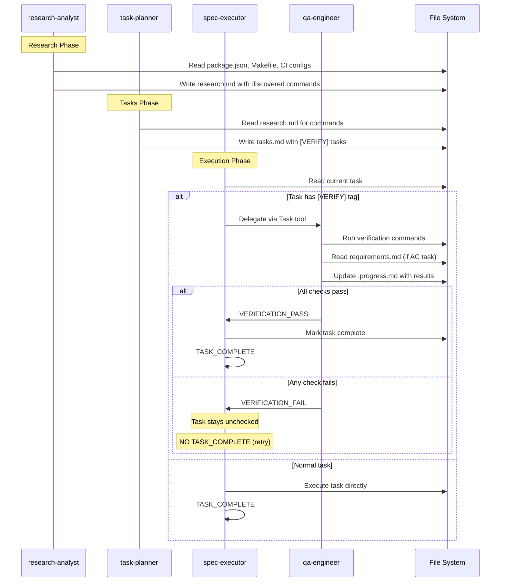

# Design: QA Verification via [VERIFY] Tasks

## Overview

This design integrates verification into the existing task flow using [VERIFY] tagged tasks. When spec-executor encounters a [VERIFY] task, it delegates to a qa-engineer agent. No separate verification phase needed. Research phase discovers actual project quality commands. Final verification sequence runs local CI first, then remote CI, then AC checklist.

## Architecture

```mermaid
graph TB
    subgraph TaskFlow["Task Execution Flow"]
        TASK{Is [VERIFY] task?}
        TASK -->|No| EXEC[spec-executor executes directly]
        TASK -->|Yes| DELEGATE[spec-executor delegates to qa-engineer]

        DELEGATE --> QA[qa-engineer agent]
        QA --> RESULT{Result?}
        RESULT -->|VERIFICATION_PASS| MARK[Mark task complete]
        RESULT -->|VERIFICATION_FAIL| RETRY[Keep task unchecked, retry]

        EXEC --> MARK
        MARK --> NEXT[Next task]
    end

    subgraph Discovery["Research Phase"]
        PKG[package.json scripts]
        MAKE[Makefile targets]
        CI[CI config commands]
        PKG --> COMMANDS[Discovered Commands]
        MAKE --> COMMANDS
        CI --> COMMANDS
        COMMANDS --> RESEARCH[research.md]
    end

    subgraph TaskGen["Task Planning"]
        RESEARCH --> PLANNER[task-planner]
        PLANNER --> VERIFY_TASKS["[VERIFY] tasks with actual commands"]
    end

    VERIFY_TASKS --> TaskFlow
```

## Components

### Component 1: qa-engineer Agent

**Purpose**: Execute [VERIFY] tasks by running verification commands and checking acceptance criteria.

**Responsibilities**:
- Receive [VERIFY] task details from spec-executor
- Parse task description for verification commands
- Run specified commands (lint, typecheck, test, build)
- For AC checklist tasks, read requirements.md and verify each AC-*
- Output VERIFICATION_PASS or VERIFICATION_FAIL
- Log results in .progress.md Learnings

**File**: `plugins/ralph-specum/agents/qa-engineer.md`

**Frontmatter**:
```yaml
---
name: qa-engineer
description: QA engineer that runs verification commands and checks acceptance criteria for [VERIFY] tasks.
model: inherit
tools: [Read, Write, Edit, Bash, Glob, Grep]
---
```

**Interfaces**:
```typescript
// Input context (passed via Task tool prompt from spec-executor)
interface QAEngineerInput {
  specName: string;
  specPath: string;
  taskDescription: string;  // e.g., "V4 [VERIFY] Full local CI: pnpm lint && pnpm test"
  taskBody: string;         // Do/Verify/Done when sections
}

// Output signal
type VerificationSignal = "VERIFICATION_PASS" | "VERIFICATION_FAIL";

// Result logged in .progress.md
interface VerificationResult {
  task: string;
  status: "PASS" | "FAIL";
  commands: CommandResult[];
  acResults?: ACResult[];  // Only for AC checklist tasks
  issues?: string[];
}

interface CommandResult {
  command: string;
  exitCode: number;
  passed: boolean;
  output?: string;  // Truncated if long
}

interface ACResult {
  id: string;         // AC-1.1, AC-2.3, etc.
  description: string;
  status: "PASS" | "FAIL" | "SKIP";
  evidence: string;
}
```

### Component 2: spec-executor Updates

**Purpose**: Detect [VERIFY] tasks and delegate to qa-engineer.

**Responsibilities**:
- Parse task description for [VERIFY] tag
- If [VERIFY] found, use Task tool to invoke qa-engineer
- Pass task details as context
- Handle VERIFICATION_PASS as task success
- Handle VERIFICATION_FAIL by NOT marking task complete, allowing retry

**File**: `plugins/ralph-specum/agents/spec-executor.md`

**Change**: Add [VERIFY] task handling section

```markdown
## [VERIFY] Task Handling

<mandatory>
When task description contains [VERIFY] tag:
1. DO NOT execute task directly
2. Invoke qa-engineer agent via Task tool with:
   - Spec name and path
   - Full task description
   - Task body (Do/Verify/Done when sections)
3. Wait for qa-engineer output
4. If VERIFICATION_PASS: proceed normally (mark complete, commit, TASK_COMPLETE)
5. If VERIFICATION_FAIL:
   - Do NOT mark task as complete
   - Do NOT output TASK_COMPLETE
   - Log failure details in .progress.md
   - Task will be retried on next iteration
</mandatory>
```

### Component 3: task-planner Updates

**Purpose**: Generate [VERIFY] tasks at quality checkpoints.

**Responsibilities**:
- Replace generic "Quality Checkpoint" with [VERIFY] tagged tasks
- Use quality commands discovered in research.md
- Place [VERIFY] tasks every 2-3 tasks
- Generate final verification sequence (V4/V5/V6)

**File**: `plugins/ralph-specum/agents/task-planner.md`

**Changes**: Update Quality Checkpoint section and add [VERIFY] task format

### Component 4: research-analyst Updates

**Purpose**: Discover actual quality commands from project configuration.

**Responsibilities**:
- Scan package.json for lint/typecheck/test/build scripts
- Check Makefile for relevant targets
- Scan CI config files for commands
- Document findings in research.md Quality Commands section

**File**: `plugins/ralph-specum/agents/research-analyst.md`

**Change**: Add quality command discovery section

## Data Flow



## Technical Decisions

| Decision | Options Considered | Choice | Rationale |
|----------|-------------------|--------|-----------|
| Verification model | Separate phase, Integrated tasks | Integrated [VERIFY] tasks | Simpler architecture, no phase enum changes, uses existing loop |
| Trigger mechanism | Auto after execution, Manual command, Inline tasks | Inline tasks | Natural fit with POC-first workflow, checkpoints throughout |
| Command discovery | Hardcoded defaults, Auto-detect from config | Auto-detect | Projects have different commands, avoids assumptions |
| Delegation pattern | spec-executor runs directly, Delegate to qa-engineer | Delegate | Clean separation, qa-engineer can have specialized logic |
| Failure handling | Block entirely, Keep unchecked for retry | Keep unchecked for retry | Allows fixes then re-run, aligns with existing task retry |
| Result storage | Separate verification.md, .progress.md | .progress.md Learnings | Simpler, follows existing pattern |
| Final sequence order | Any order, Local-first | Local-first (V4/V5/V6) | Faster feedback, saves CI resources |

## File Structure

| File | Action | Purpose |
|------|--------|---------|
| `plugins/ralph-specum/agents/qa-engineer.md` | Create | QA agent for [VERIFY] tasks |
| `plugins/ralph-specum/agents/spec-executor.md` | Modify | Add [VERIFY] task delegation logic |
| `plugins/ralph-specum/agents/task-planner.md` | Modify | Add [VERIFY] task format, update checkpoint format |
| `plugins/ralph-specum/agents/research-analyst.md` | Modify | Add quality command discovery section |

## NOT Required (Simplified Architecture)

| File | Original Plan | Why Not Needed |
|------|---------------|----------------|
| `commands/verify.md` | New command | Verification is inline via [VERIFY] tasks |
| `schemas/spec.schema.json` | Add "verification" phase | No new phase needed |
| `hooks/scripts/stop-handler.sh` | Phase handling | Uses existing execution loop |
| `templates/verification.md` | Report template | Results go in .progress.md |
| `commands/start.md` | Add verification to resume | No verification phase |
| `commands/help.md` | Add verify command | No verify command |

## [VERIFY] Task Format

```markdown
## Quality Checkpoint ([VERIFY])

- [ ] V1 [VERIFY] Quality check: <actual lint command> && <actual typecheck command>
  - **Do**: Run quality commands discovered from project config
  - **Verify**: All commands exit 0
  - **Done when**: No lint errors, no type errors
  - **Commit**: `chore(scope): pass quality checkpoint` (if fixes needed)
```

## Final Verification Sequence

<mandatory>
The last 3 tasks of every spec MUST be the final verification sequence in this order:
</mandatory>

```markdown
## Phase 4: Quality Gates

... (existing 4.1 local check, 4.2 create PR) ...

- [ ] V4 [VERIFY] Full local CI: <lint> && <typecheck> && <test> && <build>
  - **Do**: Run complete local CI suite using discovered commands
  - **Verify**: All commands pass with exit code 0
  - **Done when**: Build succeeds, all tests pass, no lint/type errors
  - **Commit**: `chore(scope): pass local CI` (only if fixes needed)

- [ ] V5 [VERIFY] CI pipeline passes
  - **Do**: Verify GitHub Actions/CI pipeline passes
  - **Verify**: `gh pr checks` shows all checks passing
  - **Done when**: All CI checks green
  - **Commit**: None (verification only)

- [ ] V6 [VERIFY] AC checklist
  - **Do**: Read requirements.md, verify each AC-* is satisfied by implementation
  - **Verify**: Each acceptance criterion has corresponding implementation
  - **Done when**: All acceptance criteria confirmed met
  - **Commit**: None (verification only)
```

## qa-engineer Agent Detail

```markdown
---
name: qa-engineer
description: QA engineer that runs verification commands and checks acceptance criteria for [VERIFY] tasks.
model: inherit
tools: [Read, Write, Edit, Bash, Glob, Grep]
---

## When Invoked

You receive a [VERIFY] task from spec-executor. Execute verification and output result.

## Execution Flow

1. Parse task description for verification type:
   - Commands after colon (e.g., "V1 [VERIFY] Quality check: pnpm lint && pnpm test")
   - AC checklist (V6 task)

2. For command verification:
   - Run each command via Bash
   - Capture exit code and output
   - All commands must pass (exit 0)

3. For AC checklist verification:
   - Read requirements.md
   - Extract all AC-* entries
   - For each AC, verify implementation satisfies it
   - Check code, run tests, inspect behavior
   - Mark each AC as PASS/FAIL/SKIP with evidence

4. Update .progress.md Learnings with results

5. Output signal:
   - All checks pass: VERIFICATION_PASS
   - Any check fails: VERIFICATION_FAIL

## Output Format

On success:
```
Verified V4 [VERIFY] Full local CI
- pnpm lint: PASS
- pnpm typecheck: PASS
- pnpm test: PASS (15 passed, 0 failed)
- pnpm build: PASS

VERIFICATION_PASS
```

On failure:
```
Verified V4 [VERIFY] Full local CI
- pnpm lint: FAIL
  Error: 3 lint errors found
  - src/foo.ts:10 - unexpected console.log
  - src/bar.ts:25 - missing return type
  - src/bar.ts:30 - unused variable
- pnpm typecheck: PASS
- pnpm test: SKIPPED (lint failed first)

VERIFICATION_FAIL
```

## AC Checklist Format

For V6 [VERIFY] AC checklist:
```
Verified V6 [VERIFY] AC checklist

| AC | Description | Status | Evidence |
|----|-------------|--------|----------|
| AC-1.1 | Tasks with [VERIFY] tag recognized | PASS | spec-executor.md line 45 |
| AC-1.2 | [VERIFY] at checkpoints | PASS | tasks.md shows V1, V2, V3 |
| AC-2.1 | Detects [VERIFY] tag | PASS | grep confirms detection |
| AC-2.2 | Delegates to qa-engineer | FAIL | Task tool call not found |

1 AC failed: AC-2.2

VERIFICATION_FAIL
```

<mandatory>
VERIFICATION_FAIL if:
- Any command exits non-zero
- Any AC is marked FAIL

VERIFICATION_PASS only if:
- All commands exit 0
- All ACs are PASS or SKIP (no FAIL)
</mandatory>
```

## spec-executor [VERIFY] Section

Add to spec-executor.md:

```markdown
## [VERIFY] Task Handling

<mandatory>
When you receive a task with [VERIFY] in the description:

1. **Detect**: Check if task description contains "[VERIFY]"

2. **Delegate**: Use Task tool to invoke qa-engineer:
   ```
   Task: Execute this verification task

   Spec: <spec-name>
   Path: <spec-path>

   Task: <full task description>

   Task Body:
   <Do/Verify/Done when sections>
   ```

3. **Handle Result**:
   - VERIFICATION_PASS:
     - Mark task complete in tasks.md
     - Update .progress.md
     - Commit (if fixes made)
     - Output TASK_COMPLETE

   - VERIFICATION_FAIL:
     - Do NOT mark task complete
     - Do NOT output TASK_COMPLETE
     - Log failure in .progress.md Learnings
     - Task will retry on next iteration

4. **Never execute [VERIFY] tasks directly** - always delegate to qa-engineer
</mandatory>
```

## task-planner [VERIFY] Section

Add to task-planner.md:

```markdown
## [VERIFY] Task Format

<mandatory>
Replace generic "Quality Checkpoint" tasks with [VERIFY] tagged tasks:

**Standard [VERIFY] checkpoint** (every 2-3 tasks):
```markdown
- [ ] V1 [VERIFY] Quality check: <discovered lint cmd> && <discovered typecheck cmd>
  - **Do**: Run quality commands and verify all pass
  - **Verify**: All commands exit 0
  - **Done when**: No lint errors, no type errors
  - **Commit**: `chore(scope): pass quality checkpoint` (if fixes needed)
```

**Final verification sequence** (last 3 tasks of spec):
```markdown
- [ ] V4 [VERIFY] Full local CI: <lint> && <typecheck> && <test> && <build>
  - **Do**: Run complete local CI suite
  - **Verify**: All commands pass
  - **Done when**: Build succeeds, all tests pass
  - **Commit**: `chore(scope): pass local CI` (if fixes needed)

- [ ] V5 [VERIFY] CI pipeline passes
  - **Do**: Verify GitHub Actions/CI passes after push
  - **Verify**: `gh pr checks` shows all green
  - **Done when**: CI pipeline passes
  - **Commit**: None

- [ ] V6 [VERIFY] AC checklist
  - **Do**: Read requirements.md, verify each AC-* is satisfied
  - **Verify**: Manual review against implementation
  - **Done when**: All acceptance criteria confirmed met
  - **Commit**: None
```

**Discovery**: Read research.md for actual project commands. Do NOT assume `pnpm lint` or `npm test` exists.
</mandatory>
```

## research-analyst Discovery Section

Add to research-analyst.md:

```markdown
## Quality Command Discovery

<mandatory>
During research, discover actual quality commands for [VERIFY] tasks:

### Sources to Check

1. **package.json** (primary):
   ```bash
   cat package.json | jq '.scripts'
   ```
   Look for: `lint`, `typecheck`, `type-check`, `check-types`, `test`, `build`

2. **Makefile** (if exists):
   ```bash
   grep -E '^[a-z]+:' Makefile
   ```
   Look for: `lint`, `test`, `check`, `build` targets

3. **CI configs** (.github/workflows/*.yml):
   ```bash
   grep -E 'run:' .github/workflows/*.yml
   ```
   Extract actual commands from CI steps

### Output Format

Add to research.md:

```markdown
## Quality Commands

| Type | Command | Source |
|------|---------|--------|
| Lint | `pnpm run lint` | package.json scripts.lint |
| TypeCheck | `pnpm run check-types` | package.json scripts.check-types |
| Test | `pnpm test` | package.json scripts.test |
| Build | `pnpm run build` | package.json scripts.build |

**Local CI**: `pnpm run lint && pnpm run check-types && pnpm test && pnpm run build`
```

If command not found, mark as "Not found" so task-planner knows to skip that check.
</mandatory>
```

## Error Handling

| Error Scenario | Handling Strategy | User Impact |
|----------------|-------------------|-------------|
| [VERIFY] tag parsing fails | Treat as normal task | Task executes directly |
| qa-engineer invocation fails | Retry task | Task stays unchecked |
| Command not found | Mark as SKIP, continue | Report in results |
| Command times out | Mark as FAIL | Verification fails, retry |
| AC ambiguous | Mark as SKIP with explanation | Documented in learnings |
| All commands missing | All SKIP, VERIFICATION_PASS | No failures = pass |

## Edge Cases

- **No [VERIFY] tasks in tasks.md**: Backward compatible, spec executes normally
- **All quality commands missing**: All checks SKIP, verification passes (no failures)
- **Partial command failure**: Any FAIL causes VERIFICATION_FAIL
- **Long test output**: Truncate to last 50 lines in learnings
- **Quick mode specs**: Include at least V4/V5/V6 for final validation
- **Re-running [VERIFY] task**: Works same as any task retry

## Test Strategy

### Unit Tests

Not applicable for markdown agent files. Testing via integration.

### Integration Tests

1. **[VERIFY] tag detection**
   - Create task with [VERIFY] tag
   - Verify spec-executor delegates to qa-engineer
   - Verify qa-engineer runs commands

2. **VERIFICATION_PASS flow**
   - Mock all commands passing
   - Verify task marked complete
   - Verify TASK_COMPLETE output

3. **VERIFICATION_FAIL flow**
   - Mock command failing
   - Verify task NOT marked complete
   - Verify NO TASK_COMPLETE output
   - Verify retry on next iteration

4. **AC checklist verification**
   - Create requirements.md with ACs
   - Run V6 [VERIFY] AC checklist task
   - Verify each AC checked and reported

### E2E Tests

1. **Full workflow with [VERIFY] tasks**
   - Generate spec with [VERIFY] checkpoints
   - Execute through all tasks
   - Verify [VERIFY] tasks handled correctly
   - Verify final V4/V5/V6 sequence runs

## Performance Considerations

- [VERIFY] tasks should complete in under 2 minutes each
- Long test suites may require larger timeouts
- Consider --skip-tests flag for faster iteration

## Security Considerations

- Commands executed in user's shell environment
- No external network calls except CI checks
- Output may contain code snippets (sanitize if sensitive)

## Existing Patterns to Follow

Based on codebase analysis:

1. **Agent frontmatter pattern**: name, description, model: inherit, tools array
2. **Mandatory blocks**: Use `<mandatory>` tags for critical rules
3. **Signal pattern**: TASK_COMPLETE for execution, VERIFICATION_PASS/FAIL for verification
4. **Progress append pattern**: Always append learnings to .progress.md
5. **Task delegation**: spec-executor already uses Task tool
6. **Quality checkpoint pattern**: Already exists, extend with [VERIFY] tag
