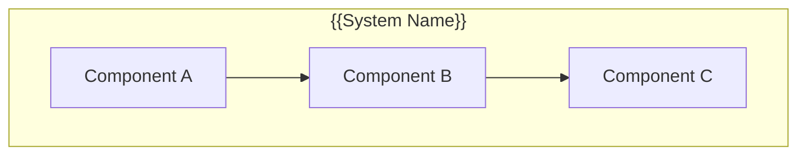
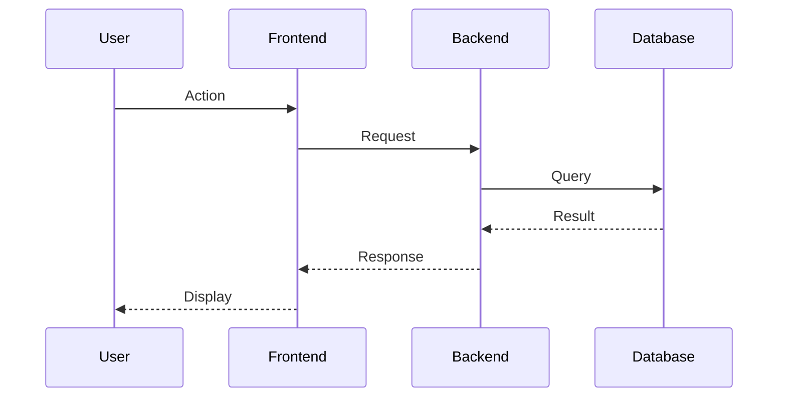

# Design: {{FEATURE_NAME}}

## Overview

{{High-level description of the design approach}}

## Architecture

### Component Diagram



### Data Flow



## File Structure

| File | Action | Purpose |
|------|--------|---------|
| {{path/to/file.ts}} | Create | {{purpose}} |
| {{path/to/file.ts}} | Modify | {{purpose}} |
| {{path/to/file.ts}} | Delete | {{reason}} |

## Key Patterns

### Pattern 1: {{Name}}

{{Description of pattern and why it's used}}

```typescript
// Example code
```

### Pattern 2: {{Name}}

{{Description}}

## API Design

### Endpoints

| Method | Path | Description |
|--------|------|-------------|
| GET | /api/{{resource}} | {{description}} |
| POST | /api/{{resource}} | {{description}} |

### Request/Response

```typescript
// Request type
interface {{Name}}Request {
  {{field}}: {{type}};
}

// Response type
interface {{Name}}Response {
  {{field}}: {{type}};
}
```

## Data Models

```typescript
interface {{Model}} {
  id: string;
  {{field}}: {{type}};
  createdAt: Date;
  updatedAt: Date;
}
```

## Dependencies

| Package | Version | Purpose |
|---------|---------|---------|
| {{package}} | {{version}} | {{purpose}} |

## Technical Constraints

- {{constraint 1}}
- {{constraint 2}}

## Security Considerations

- {{consideration 1}}
- {{consideration 2}}

## Performance Considerations

- {{consideration 1}}
- {{consideration 2}}

## Edge Cases

| Case | Handling |
|------|----------|
| {{case}} | {{handling}} |

## Testing Strategy

- Unit tests for: {{components}}
- Integration tests for: {{flows}}
- E2E tests for: {{scenarios}}
